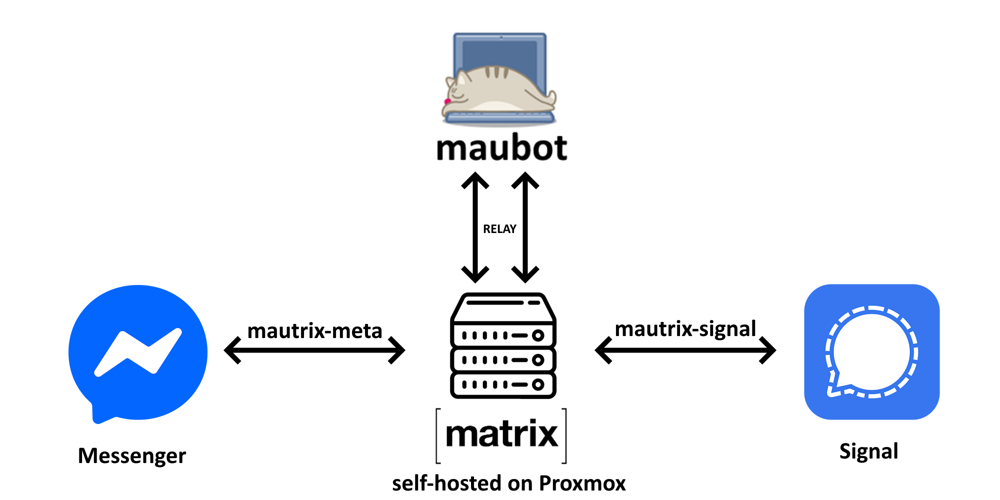

# maubot-bridge-relay

A [maubot](https://github.com/maubot/maubot) plugin that relays messages between two bridged Matrix rooms. It was built to connect a **Facebook Messenger** group and a **Signal** group through self-hosted [mautrix](https://github.com/mautrix) bridges, but it works with any two rooms whose bridges support relay mode.

Was created since not all of us use facebook, but still have that **one** group we'd like to be part of.

**New to this? Follow the [full setup guide](SETUP.md).**



## Features

- **Messenger → Signal:** forwards everything (text, images, videos, files, audio) as `Name (Messenger): text`.
- **Signal → Messenger:** opt-in. Only messages starting with `!m` are forwarded, with the trigger stripped. Easy to modify!
- **Native replies** in both directions. The plugin remembers which message became which.
- **Reaction lists:** in the Signal group, reply `!r` to a forwarded message, or react to it with 🔎 / 🔍 (silent), and the bot lists who reacted with what on the Messenger side.
- **`!health`** reports each bridge's login status (connected, logged out, unreachable) via the mautrix provisioning API.
- **Alerts:** warnings from the bridge bots (for example "logged out") are forwarded to an alert room, such as your own Signal DM.
- **Safety:** no echo loops (the bot ignores its own messages), edits are skipped, old/backfilled events are ignored, and bridge name suffixes such as "(Signal)" are stripped.

## How it works

```
Messenger group ⇄ mautrix-meta ⇄ [Messenger room] ⇄ relay bot ⇄ [Signal room] ⇄ mautrix-signal ⇄ Signal group
```

The bot is a normal Matrix account in both rooms. Each bridge runs in **relay mode**, so messages the bot posts are sent to the remote network through a logged-in bridge account.

## Requirements

- A Matrix homeserver with maubot (tested with [matrix-docker-ansible-deploy](https://github.com/spantaleev/matrix-docker-ansible-deploy))
- mautrix bridges (bridgev2) with **relay mode** enabled, and the relay message formats set to pass the bot's text through unchanged
- **Unencrypted** portal rooms (the plugin does not handle end-to-end encryption)

See [`examples/playbook-vars.example.yml`](examples/playbook-vars.example.yml) for the relevant playbook configuration.

## Installation

1. **Build the plugin** with `./build.sh`, which creates `relay-vX.Y.Z.mbp`.
2. **Upload it** in the maubot web UI under **Plugins → +**.
3. **Create a client** for the bot account (Clients → +) with an access token obtained via the login API, and enable **Autojoin**.
4. **Prepare both portal rooms:** invite the bot to each one, then run the bridge's `set-relay` command in it (for example `!signal set-relay` and `!fb set-relay`).
5. **Create an instance** (Instances → +) with the client and the `no.andreash.relay` plugin, and fill in the config.

## Configuration

| Key | Description |
|---|---|
| `messenger_room` / `signal_room` | Room IDs of the two portal rooms |
| `trigger` | Prefix for Signal → Messenger messages (default `!m`) |
| `messenger_label` / `signal_label` | Shown after sender names |
| `alert_rooms` / `alert_target` | Bridge-bot management rooms to watch, and where to forward their warnings |
| `health_command`, `bridge_user`, `bridges` | `!health` settings. Each bridge needs its internal URL and `provisioning.shared_secret` |
| `reactions_command`, `reactions_emojis` | Triggers for the reaction list |

The shared secrets live only in the maubot instance config, never in this repository.

## Limitations

- Replies and reaction lists only work for messages forwarded **after** the plugin was installed, because older messages have no mapping.
- Reactions are not mirrored natively. Both networks allow one reaction per account, so a single relay account cannot represent everyone's reactions.
- Signal has no silent messages, so bot answers always notify.

## ⚠️ Disclaimer

Bridging a personal Messenger account with unofficial clients is against Meta's terms of service, and the account may get checkpointed or banned. Use an account you can afford to lose. Messages from other people pass through your server, so tell both groups that they are being bridged.

## AI declaration

The plugin code, build script and documentation in this repository were written
by Claude (Anthropic). My part was the
project idea, the design decisions, setting up and running the
infrastructure (Proxmox, Tailscale, matrix-docker-ansible-deploy, the bridges and
maubot), testing and debugging everything against the live setup. 

**I have reviewed the code, but did not write it myself.**

## License

MIT
